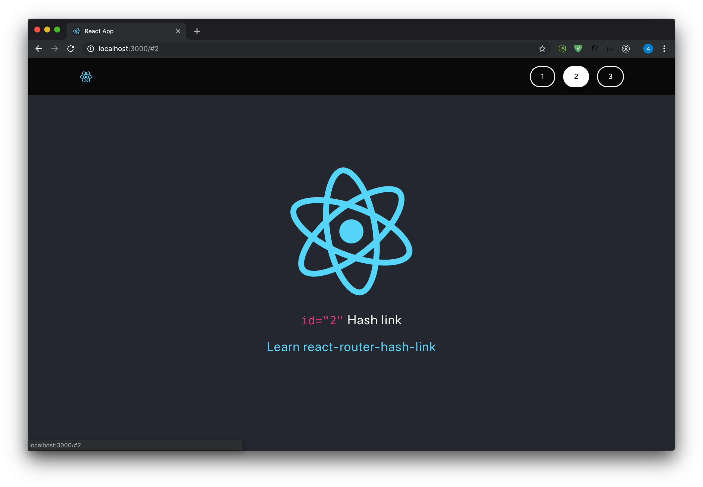

# ReactStarter + # Hash (anchor) link 
## updated: june 2019



<br><hr><br>

# REMINDER

## Install node.js
```sh
$ yarn i 
```

## Runing React App
```sh
$ yarn start 
# will automatically open the project in localhost
```

## Install React (allready installed)
```sh
$ yarn global add create-react-app
$ create-react-app myreactwebappname
```

## Install router + SASS + Bootstrap + Scroll animation + styled-components + Font-awesome (allready installed)
```sh
$ yarn add react-router-dom node-sass jquery popper.js bootstrap react-scroll styled-components font-awesome
```

src/index.js:
```ES6
/** CSS */
/** bootstrap */
import 'bootstrap/dist/css/bootstrap.css'
/** font-awesome */
import 'font-awesome/css/font-awesome.min.css'

/** JS */
/** jQuery first, then Popper.js, then Bootstrap JS */
import 'jquery/dist/jquery.min.js'
import 'popper.js/dist/popper-utils.js'
import 'bootstrap/dist/js/bootstrap.min.js'
```

## Install Hash Link + Scroll spy (allready installed)
```sh
yarn add react-router-hash-link react-scrollspy
```


## [Convert online favicon to .ico](https://redketchup.io/icon-converter) 🥫
64, 32, 24, 16


<br><hr><br>

&copy; 2019 [Alexia Lechot](https://uxmilk.co)